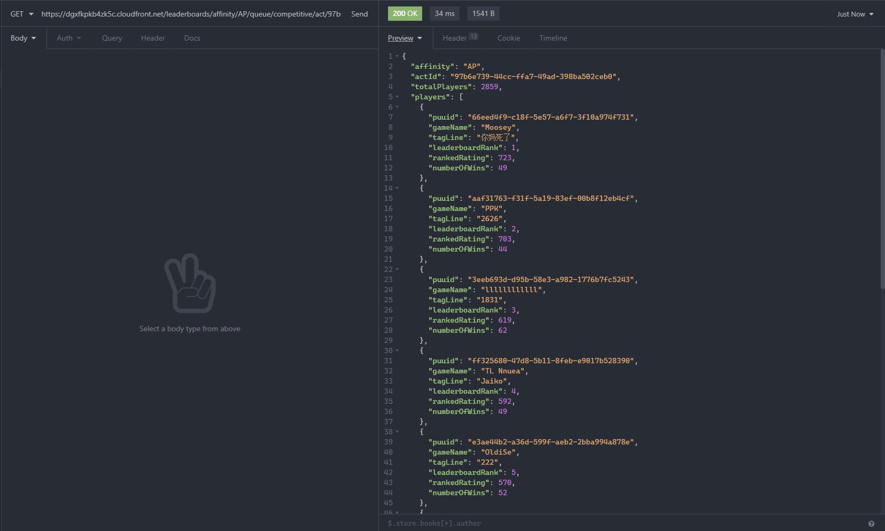

# [VALORANT Leaderboards API](https://playvalorant.com/en-us/leaderboards)

VALORANT's Leaderboards API used on the [website](https://playvalorant.com) and possibly in-game

# IMPORTANT NOTE:

- Different regions have different servers, hence each region has a slightly different URL. I will be using the example of APAC (or AP // Asia Pacific) server.

# Table of regions

| Region name   | Region code |
| ------------- | ----------- |
| North America | NA          |
| Europe        | EU          |
| Korea         | KR          |
| Brazil        | BR          |
| Asia Pacific  | AP          |
| Latin America | LATAM       |

# Getting Started

## URL Parameters

| Params     | Values                               |
| ---------- | ------------------------------------ |
| urlCode    | dgxfkpkb4zk5c                        |
| region     | NA, EU, KR, BR, AP, LATAM            |
| startIndex | 0 - 499 (for Radiants)               |
| startIndex | 500+ (for Immortals)                 |
| size       | 10                                   |
| apiKey     | 97b6e739-44cc-ffa7-49ad-398ba502ceb0 |

**Template URL:** `https://{urlCode}.cloudfront.net/leaderboards/affinity/{region}/queue/competitive/act/{apiKey}?startIndex={startIndex}&size={size}`

## Example Request

> Example uses AP region

```
URL: https://dgxfkpkb4zk5c.cloudfront.net/leaderboards/affinity/AP/queue/competitive/act/97b6e739-44cc-ffa7-49ad-398ba502ceb0?startIndex=0&size=10
Request Type: GET
content-type: application/json
```

## Example Response

> Example uses AP region, the URL is the same as above. I am using [Insomnia REST Client](https://github.com/Kong/insomnia)

_Top 10 Radiants of AP region_

